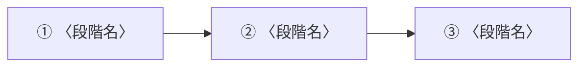

# flow_<トピック> — <業務フローの名称>

<!--
使い方:
1. flow_<トピック>.md にリネームする
2. 「情報源」を先に埋める。一次資料が手元にないなら、それを明記して始める
3. 各段階に【仮説・未確認】を付けた状態で骨組みを作る。空欄を埋めることが目的ではない
4. ヒアリング・一次資料で確認が取れた段階ごとにタグを外す
この HTML コメントは提出前に削除する。
-->

## 情報源

| 階層 | 資料名 | 版 / 取得日 | URL・パス |
|---|---|---|---|
| 一次 | | | |
| 二次 | | | |
| 三次 | | | |

<!-- 一次資料がまだ手元にない場合は、その事実をここに書く。
     「入手できていない」ことは記録すべき情報である -->

## 最終確認日

YYYY-MM-DD

## サマリー（400字以内）

<!-- このフローの要点のみを400字以内で書く。詳細は「各段階の詳細」に譲る。
     未確認点が多い段階では、その旨を1文で触れる -->

---

## フロー全体

<!-- 段階を列挙する。図にできるならMermaid等で作る -->

## 各段階の詳細

各段階について、以下を埋める。**分からない欄は空にせず「未確認」と書く。**

### ① 〈段階名〉

| 項目 | 内容 |
|---|---|
| 何が起きるか | |
| 誰が行うか（部署・担当・外部委託） | |
| いつ・どのタイミングか | |
| 使うシステム / 帳票 | |
| **データがどこに残るか** | <!-- ここが data-dictionary との接続点 --> |
| 根拠（情報源の階層とファイル） | |

**【仮説・未確認】** <!-- 未確認の点。確認方法と確認担当を併記する -->

- 確認方法:
- 確認担当:

### ② 〈段階名〉

<!-- 同じ形式で繰り返す -->

---

## この時点で分かっていないこと

<!-- 空欄にしない。ここの一覧が client-qa/ の質問の元になる -->

| # | 分かっていないこと | 影響（これが分からないと何が言えないか） | 確認先 |
|---|---|---|---|
| 1 | | | |

## 更新履歴

| 日付 | 変更内容 |
|---|---|
| YYYY-MM-DD | 起案（骨組みのみ） |
